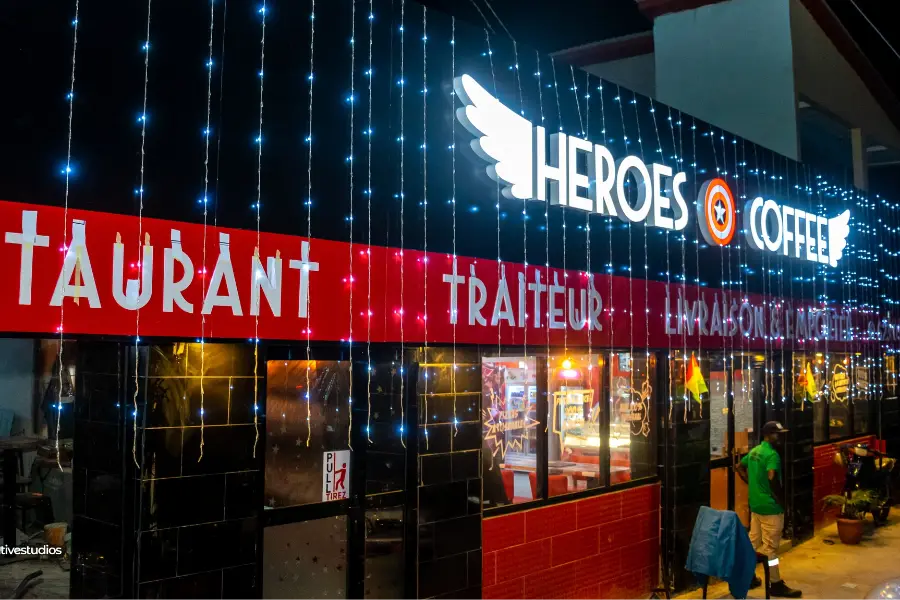
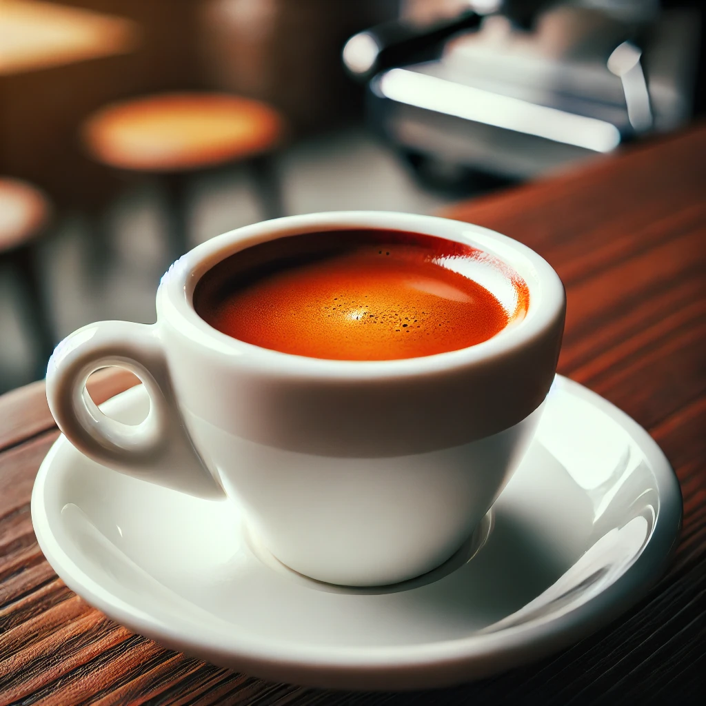
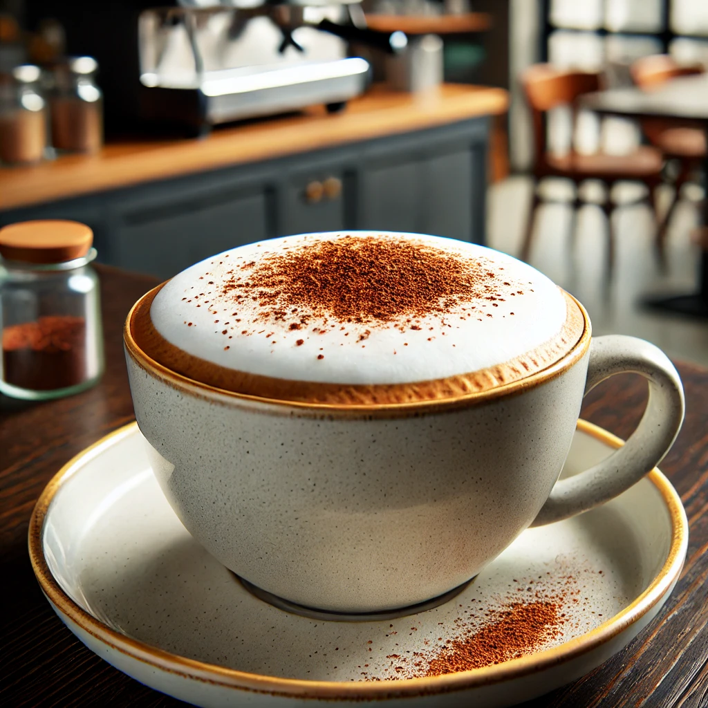
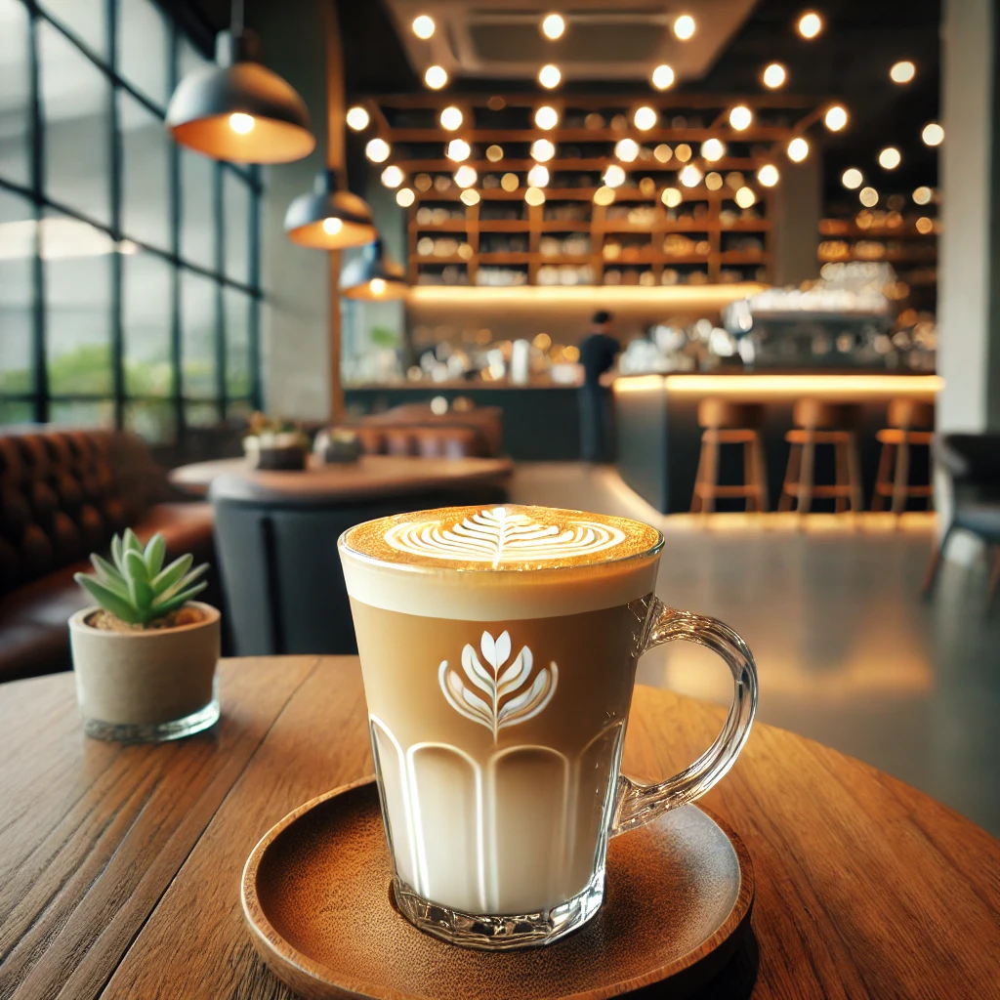
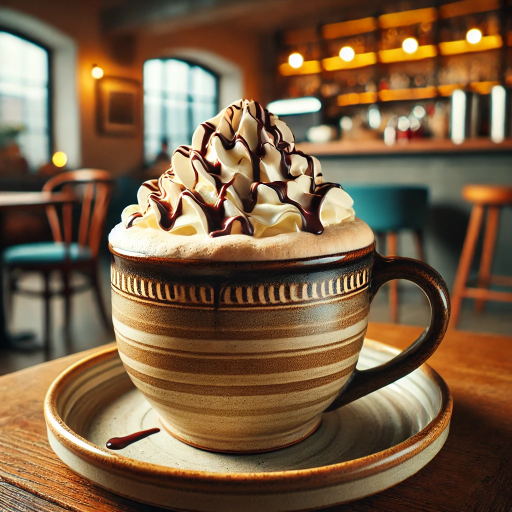
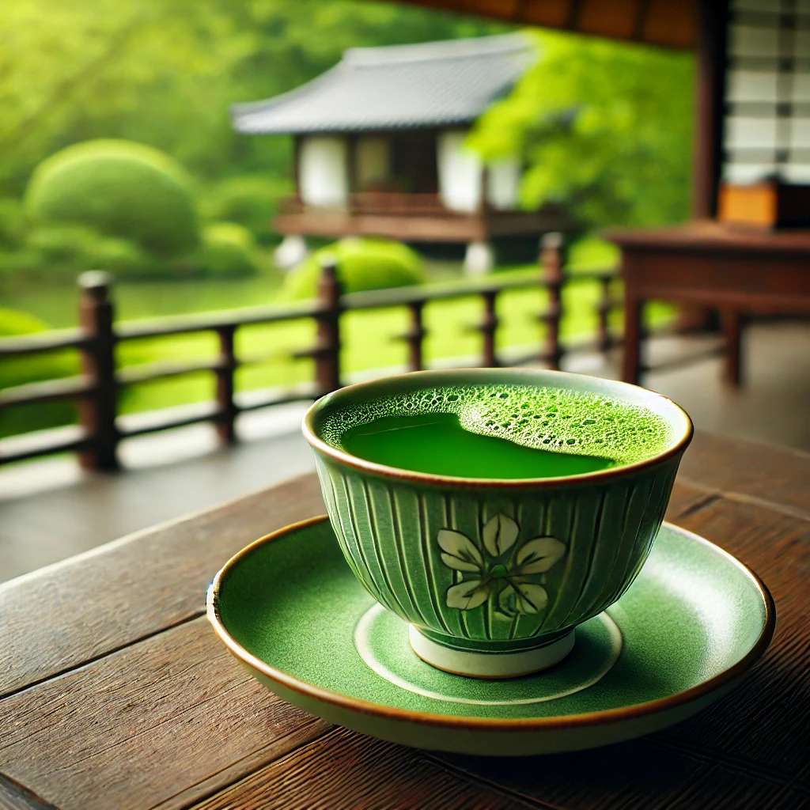
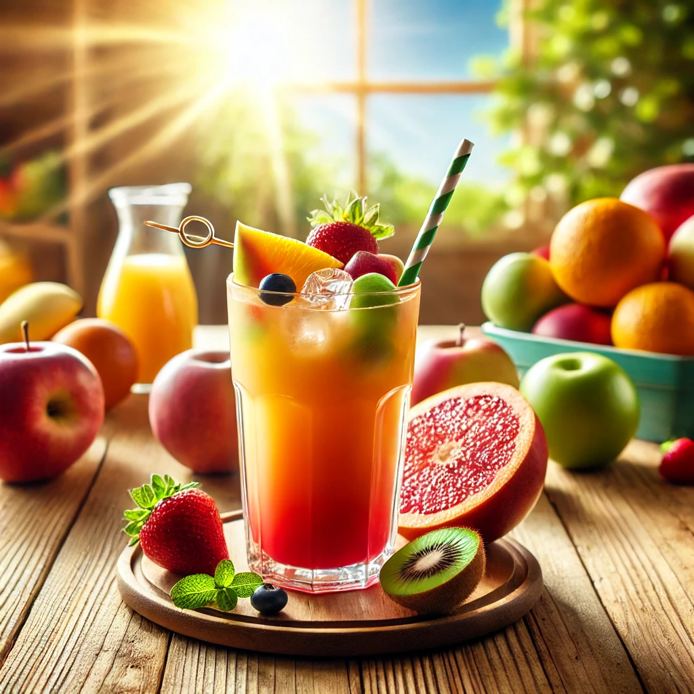
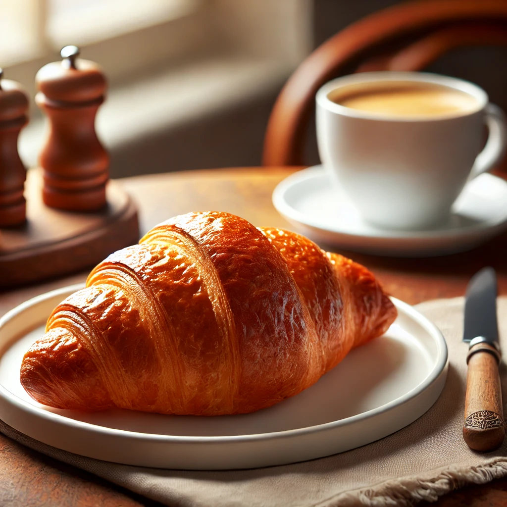
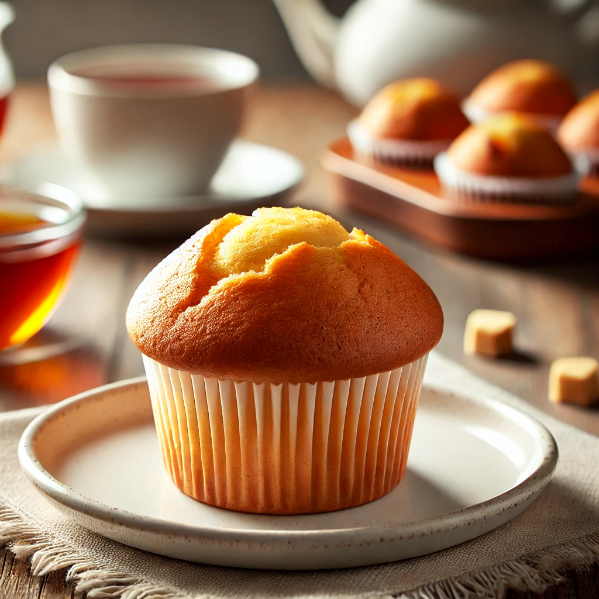
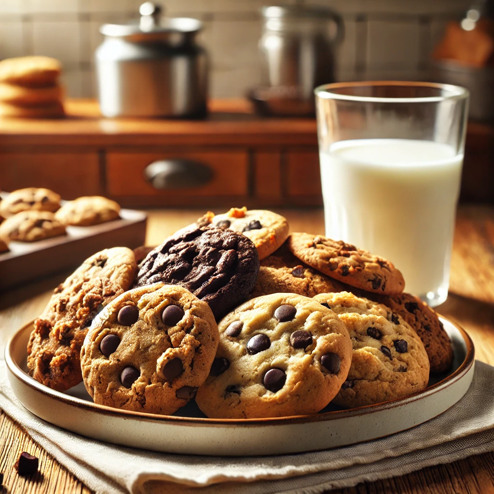

# Page d'accueil (index.html)

## Heroes Coffee

Bienvenue chez Heroes Coffee, votre destination café préférée à Conakry, en Guinée. Nous vous proposons une expérience unique, alliant saveurs exceptionnelles et ambiance chaleureuse.

# Page "À propos" (about.html)

## À propos

Heroes Coffee est né de la passion pour le café de qualité et de l'envie de partager cette passion avec les habitants de Conakry. Nous sélectionnons soigneusement nos grains de café auprès de producteurs locaux et internationaux, pour vous offrir les meilleurs arômes et saveurs.

# Page "Menu" (menu.html)

## Menu

Découvrez notre sélection de boissons et de pâtisseries :

- [Espresso](plat1.html)
- [Cappuccino](plat2.html)
- [Latte](plat3.html)
- [Mocha](plat4.html)
- [Thé vert](plat5.html)
- [Thé noir](plat6.html)
- [Jus de fruits frais](plat7.html)
- [Croissants](plat8.html)
- [Muffins](plat9.html)
- [Cookies](plat10.html)

# Pages des plats (plat1.html à plat10.html)

## Espresso (plat1.html)

Un espresso corsé et intense, préparé avec nos grains de café soigneusement sélectionnés et fraîchement moulus.

## Cappuccino (plat2.html)

Un classique italien : espresso, lait vapeur et mousse de lait, saupoudré de cacao.

## Latte (plat3.html)

Une boisson douce et crémeuse, alliant espresso et lait vapeur, idéale pour les amateurs de café au lait.

## Mocha (plat4.html)

L'alliance parfaite entre café et chocolat : espresso, lait vapeur, sauce chocolat et crème fouettée.

## Thé vert (plat5.html)

Un thé vert de qualité supérieure, aux notes végétales et délicates.

## Thé noir (plat6.html)

Un thé noir robuste et corsé, idéal pour commencer la journée.

## Jus de fruits frais (plat7.html)

Nos jus de fruits frais sont préparés à la demande, pour un maximum de saveur et de fraîcheur.

## Croissants (plat8.html)

Des croissants croustillants et fondants, préparés chaque matin par notre boulanger.

## Muffins (plat9.html)

Une sélection de muffins moelleux et savoureux, aux différents parfums (chocolat, myrtille, citron, etc.).

## Cookies (plat10.html)

Des cookies croustillants et généreux, aux pépites de chocolat ou aux noix.

# Page "Contact" (contact.html)

## Contact

Adresse : 123 Avenue de l'Indépendance, Conakry, Guinée

E-mail : [info@heroescoffee.gn](mailto:info@heroescoffee.gn)

Téléphone : +224 123 456 789

Horaires d'ouverture :
- Lundi au vendredi : 7h00 - 20h00
- Samedi et dimanche : 8h00 - 22h00

Suivez-nous sur les réseaux sociaux :
- [Facebook](https://www.facebook.com/heroescoffeeconakry)
- [Instagram](https://www.instagram.com/heroescoffeeconakry)
- [Twitter](https://www.twitter.com/heroescoffeeconakry)

Heroes Coffee - Votre pause café à Conakry
© 2023 Heroes Coffee. Tous droits réservés.

Site web créé par [WebDesign Express](https://www.webdesignexpress.com)

